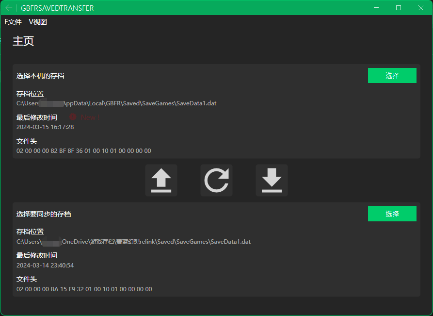
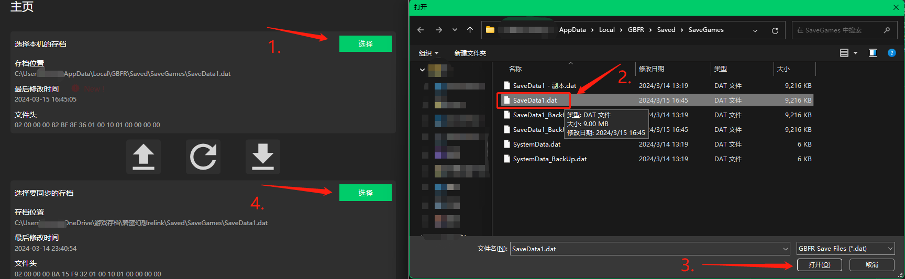
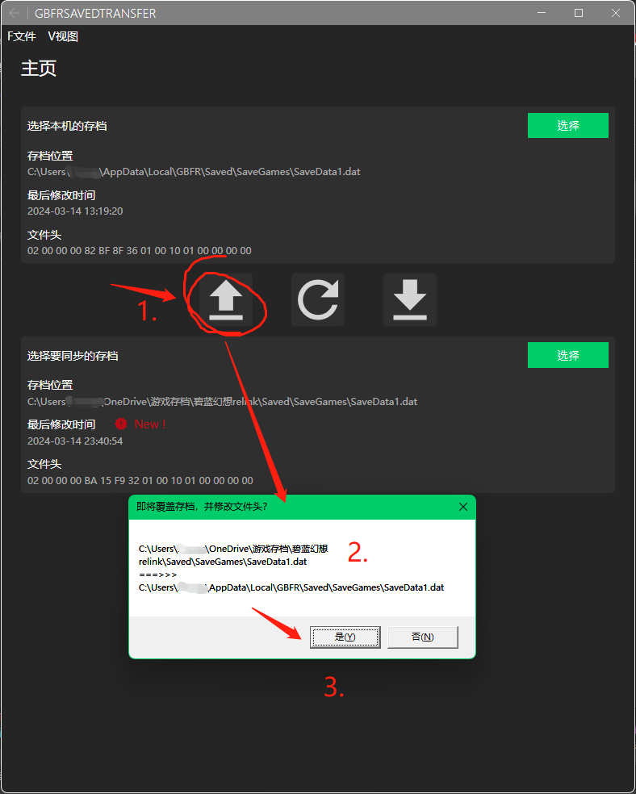

# GBFRSavedTransfer

简易的《碧蓝幻想Relink》游戏存档转移助手程序

## 免责声明 / Disclaimer

### 开始使用本程序前，请自行手动备份好您的游戏存档文件 Before starting to use this program, please manually back up your game save files.

### 在使用本程序时，造成的游戏存档丢失与损坏，全部由程序使用者本人承担。开发者概不负责！ Any loss or damage to game archives caused when using this program is entirely the responsibility of the program user. The developer is not responsible!

## 关于该程序 / About

## 使用方法 / How To Use

- 1, 查找你本机的存档文件所在的目录 / Find the directory where your local archive files are located
- 2, 选中你的存档文件 (不需要选择"_BackUp"后缀的文件)  / Select your archive file (you do not need to select the file with the "_BackUp" suffix)
- 3, 点击"打开" / Click "Open"
- 4, 重复查找并选中其它存档文件 (他人的存档文件、应用了作弊修改的存档文件)  / Repeat the search and select other archive files (other people's archive files, archive files with cheat modifications applied)

### 覆盖你本地的存档 / Overwrite your local save

- 0, 覆盖之前请自行备份你的本地存档文件，以防止覆写失败！ / Please back up your local archive files before overwriting to prevent overwriting failure!
- 1, 点击左边那个像是"上传"图标的按钮 / Click the button on the left that looks like the "Upload" icon
- 2, 确认一下 / double check it
- 3, 点击"是"进行覆写 (会自动覆写文件头，以便能够在你本机进行游玩)  / Click "Yes" to overwrite (the file header will be automatically overwritten so that it can be played on your local machine)

	---

- 至于右边的类似于"下载"图标的按钮，则是上述过程的反过程 / As for the button on the right similar to the "Download" icon, it is the reverse of the above process.
    - (将你本机的存档覆盖到其它地方) / (Overwrite your local save to other places)
    - (比如图片样例上展示的，就是将我本机的存档文件覆盖到OneDrive中，同时保留OneDrive原来的文件的文件头，以便另外一台电脑通过OneDrive进行存档更新) 
         
      (For example, what is shown in the picture sample is to overwrite my local archive file into OneDrive, while retaining the file header of the original OneDrive file so that another computer can update the archive through OneDrive)